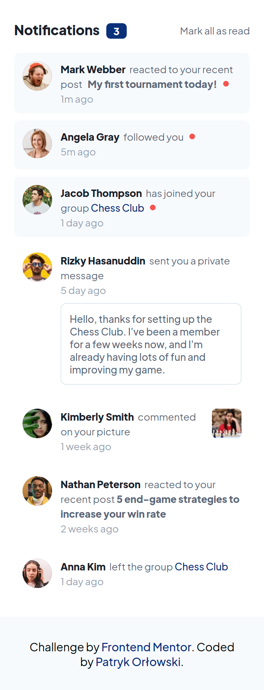
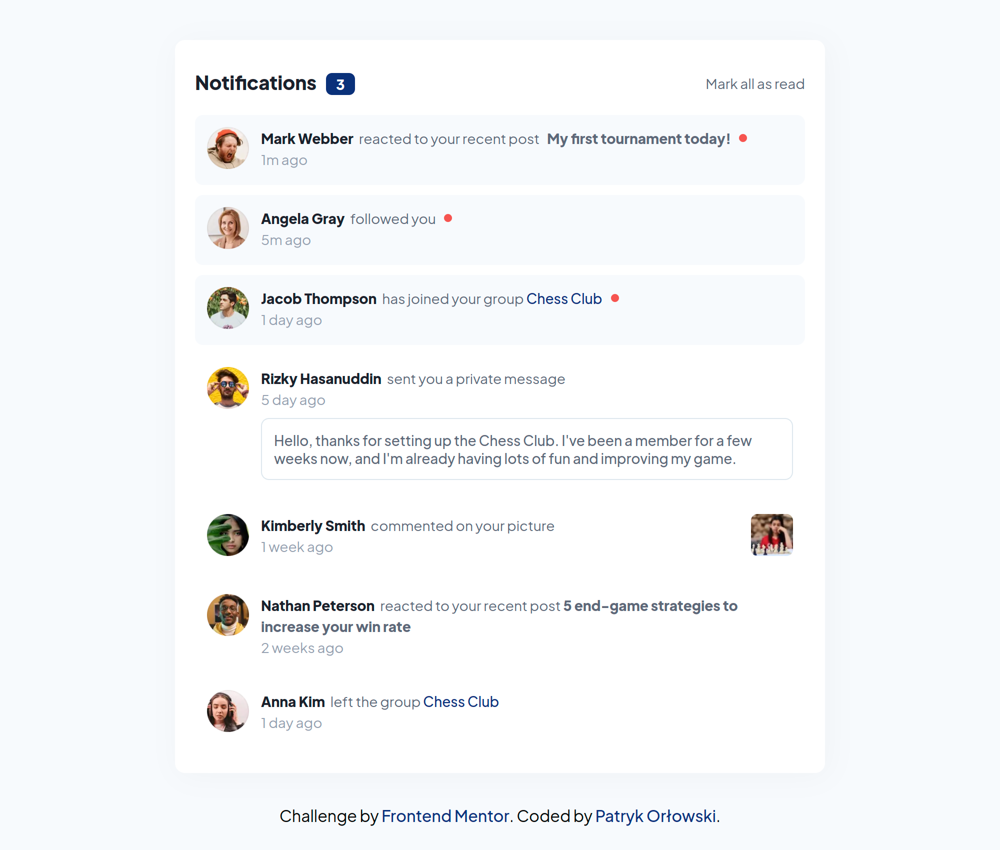

# Frontend Mentor - Notifications page solution

This is a solution to the [Notifications page challenge on Frontend Mentor](https://www.frontendmentor.io/challenges/notifications-page-DqK5QAmKbC). Frontend Mentor challenges help you improve your coding skills by building realistic projects. 

## Table of contents

- [Overview](#overview)
  - [The challenge](#the-challenge)
  - [Screenshot](#screenshot)
  - [Links](#links)
- [My process](#my-process)
  - [Built with](#built-with)
  - [What I learned](#what-i-learned)
- [Author](#author)

## Overview

### The challenge

Users should be able to:

- Distinguish between "unread" and "read" notifications
- Select "Mark all as read" to toggle the visual state of the unread notifications and set the number of unread messages to zero
- View the optimal layout for the interface depending on their device's screen size
- See hover and focus states for all interactive elements on the page

### Screenshot





### Links

- Solution URL: [GitHub](https://github.com/orlowski-dev/fm-notifications-page)
- Live Site URL: [GitHub Pages](https://orlowski-dev.github.io/fm-notifications-page)

## My process

### Built with

- Semantic HTML5 markup
- CSS custom properties
- Flexbox
- CSS Grid
- Mobile-first workflow
- JavaScript


### What I learned

Now I know I can use `querySelector()` method of variable with parent element.

```javascript
const unreadNotifications = document.querySelectorAll('article.unread');
// ...
notification.querySelector('span.unread').remove();
```

## Author

- Website - [@orlowski-dev](https://www.frontendmentor.io/profile/orlowski-dev)
